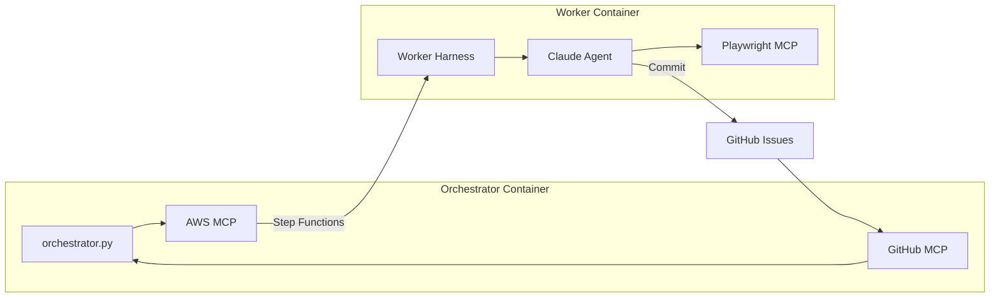
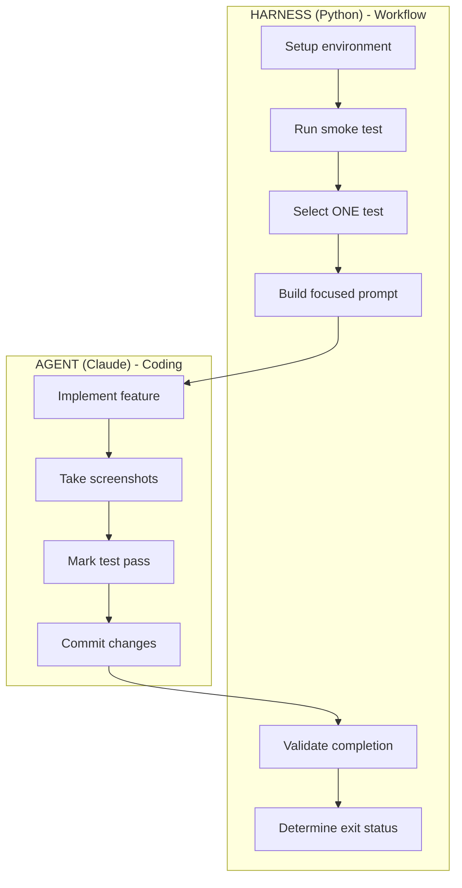
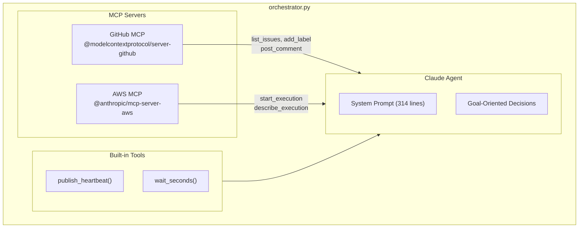
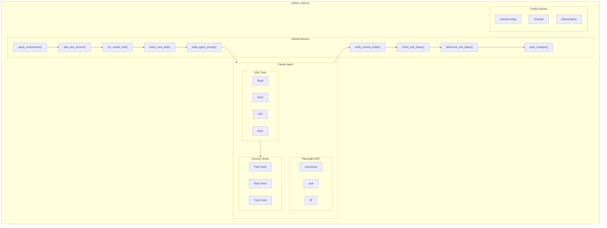
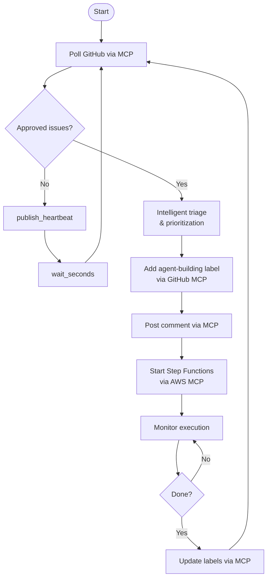
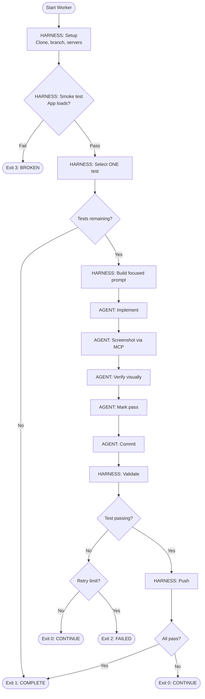
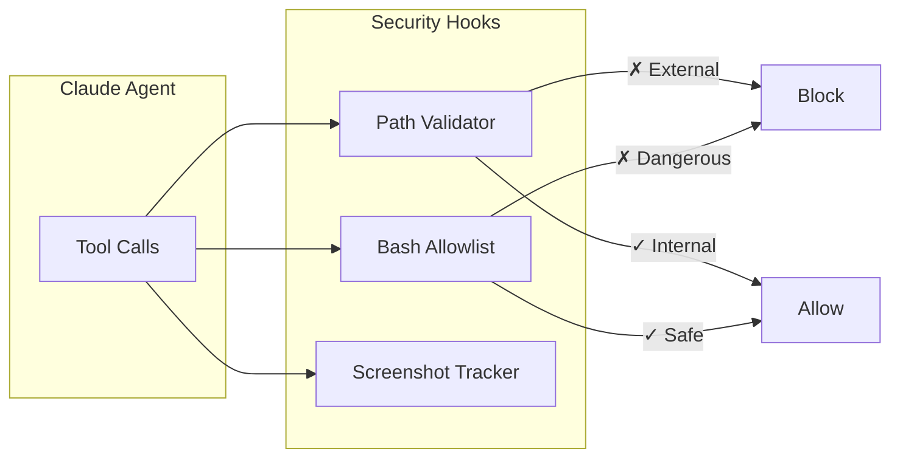
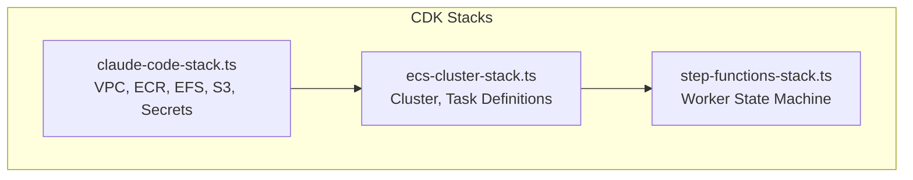

# CLAUDE.md

Development guide for the Long-Horizon Coding Agent.

## Overview

Harness-enforced two-container ECS/Fargate architecture that builds React applications from GitHub issues using Claude Agent SDK with MCP servers.



## Entry Points

| File | Container | Purpose |
|------|-----------|---------|
| `orchestrator.py` | Orchestrator | Goal-oriented AI with GitHub/AWS MCP for intelligent issue triage |
| `worker_main.py` | Worker | **Harness-based** entry point (preferred) |
| `claude_code_agent.py` | Worker | Legacy entry point (backward compatibility) |

## Run Commands

```bash
# Local development - harness-based worker
ISSUE_NUMBER=42 GITHUB_REPOSITORY=owner/repo python worker_main.py

# Local development - legacy worker
python claude_code_agent.py --project canopy

# Docker Compose
docker-compose up orchestrator  # Long-running
docker-compose up worker        # One-shot build

# Install dependencies
pip install -r requirements.txt
```

## Harness-Enforced Architecture

Based on Anthropic's ["Effective Harnesses for Long-Running Agents"](https://www.anthropic.com/engineering/effective-harnesses-for-long-running-agents).

### Failure Mode Prevention

| Failure Mode | Problem | Harness Solution |
|--------------|---------|------------------|
| **Premature Completion** | Agent declares "done" early | Harness validates tests.json |
| **Incomplete Implementation** | Half-finished features | ONE test per session |
| **Inadequate Testing** | No verification | Must view screenshot |
| **Inefficient Onboarding** | Token waste | Harness runs setup |

### Responsibility Separation



**Harness decides:** What to work on, when complete, exit status
**Agent decides:** How to implement, code quality, when to commit

### Orchestrator Internals



### Worker Internals



### Worker Exit Codes

| Code | Status | Meaning |
|------|--------|---------|
| 0 | `CONTINUE` | Test passed, more remain |
| 1 | `COMPLETE` | All tests pass |
| 2 | `FAILED` | Unrecoverable error |
| 3 | `BROKEN_STATE` | Smoke test failed |

## MCP Servers

### Orchestrator

| Server | Package | Purpose |
|--------|---------|---------|
| GitHub | `@modelcontextprotocol/server-github` | Issues, labels, comments |
| AWS | `@anthropic/mcp-server-aws` | Step Functions |

### Worker

| Server | Package | Purpose |
|--------|---------|---------|
| Playwright | `@anthropic/mcp-server-playwright` | Browser automation |

## Orchestrator Flow



## Worker Flow (Harness-Enforced)



## Core Modules

| Module | Purpose |
|--------|---------|
| `src/worker_harness.py` | Harness enforcing agent constraints |
| `src/worker_config.py` | Configuration dataclasses |
| `src/secrets.py` | AWS Secrets Manager utilities |
| `src/github_integration.py` | GitHub API (labels, comments, issues) |
| `src/security.py` | Security hooks (path validation, command allowlist) |
| `src/cloudwatch_metrics.py` | Heartbeat and metrics publishing |
| `src/git_manager.py` | Git operations (clone, branch, commit) |

## Security Model



**Allowed Bash:** npm, npx, node, git, python, playwright
**Blocked:** rm -rf, curl external, paths outside project

## Environment Variables

```bash
# Required for worker
ISSUE_NUMBER=42
GITHUB_REPOSITORY=owner/repo

# Required for orchestrator
STATE_MACHINE_ARN=arn:aws:states:...
AUTHORIZED_APPROVERS=user1,user2
GITHUB_TOKEN=ghp_...

# Optional
PROVIDER=anthropic           # or "bedrock"
AGENT_BRANCH=agent-runtime
ENVIRONMENT=local
MAX_RETRIES_PER_TEST=3
SMOKE_TEST_TIMEOUT=30
DEV_SERVER_PORT=6174
AWS_REGION=us-west-2
```

## Infrastructure (CDK)



Deploy:
```bash
cd infrastructure
npm install
cdk deploy --all
```

## Key Files

```
├── orchestrator.py              # Orchestrator with GitHub/AWS MCP
├── worker_main.py               # Harness-based worker entry
├── claude_code_agent.py         # Legacy worker entry
├── src/
│   ├── worker_harness.py        # Harness logic
│   ├── worker_config.py         # Config dataclasses
│   ├── secrets.py               # AWS Secrets Manager
│   ├── github_integration.py    # GitHub API
│   ├── security.py              # Security hooks
│   └── cloudwatch_metrics.py    # Metrics
├── prompts/
│   ├── system_prompt.txt        # Full system prompt (legacy)
│   └── worker_system_prompt.txt # Simplified worker prompt
├── infrastructure/lib/
│   ├── claude-code-stack.ts     # Core infra
│   ├── ecs-cluster-stack.ts     # ECS cluster
│   └── step-functions-stack.ts  # Step Functions
├── Dockerfile.orchestrator      # Node.js for MCP
├── Dockerfile.worker            # Node.js for MCP
└── docker-compose.yml
```

## Test Verification

The harness enforces screenshot verification:

**Screenshot Path Pattern (required):**
```
screenshots/issue-{issue_number}/{test_id}-*.png
```
Example: `screenshots/issue-42/sidebar-collapse-1702345678.png`

**Verification Process:**
1. Agent takes Playwright screenshot via MCP with correct path
2. Agent checks MCP output for console errors (shown in tool response)
3. Agent reads screenshot with Read tool to verify visually
4. Only then can agent mark test as passing (Edit tool on tests.json)
5. Harness validates tests.json after agent exits

**Console Error Detection:**
- Playwright MCP includes console output in its response
- Agent reviews MCP output for `console.error` or `console.warn`
- Console log files (`.txt`) are optional - not required for MCP workflow

Security hooks block bulk modification of tests.json.

## Completion

The **harness** (not the agent) determines completion by reading tests.json:
- All tests status = "pass" → Exit 1 (COMPLETE)
- Assigned test not passing → Exit 0 (CONTINUE) or Exit 2 (FAILED)

This prevents premature completion claims by the agent.
