# Product Requirement Document: Claude Agent SDK Modernization

**Created**: 2025-12-10
**Version**: 3.0 (Simplified)
**Status**: Complete
**Complexity**: Low

---

## Executive Summary

This project demonstrates **production patterns for long-horizon AI coding sessions** using the Claude Agent SDK and AWS Bedrock AgentCore. The architecture implements patterns from Anthropic's ["Effective Harnesses for Long-Running Agents"](https://www.anthropic.com/engineering/effective-harnesses-for-long-running-agents) article.

## Architecture

### Single Agent Design

The architecture uses a single Claude agent with full capabilities, managed by a Python session manager:

```mermaid
flowchart TB
    SessionMgr["agent.py<br/>(Session Manager)"]
    Claude["🤖 Claude Agent<br/>(Claude Agent SDK)"]
    Files["📁 State Files<br/>tests.json, claude-progress.txt"]
    Git["📦 Git<br/>Commits as checkpoints"]

    SessionMgr -->|"creates"| Claude
    Claude -->|"reads/writes"| Files
    Claude -->|"commits"| Git
```

### Key Components

| Component | Role |
|-----------|------|
| `aws_runner.py` | Runtime entrypoint (spawns agent.py as subprocess) |
| `agent.py` | Session manager (creates SDK client, manages state) |
| Claude Agent | Implements features, runs tests, commits changes |

### Why Single Agent?

The original design included an Orchestrator + Worker pattern, but this added unnecessary complexity:

1. **Session management is already handled by `agent.py`** - State machine, completion detection, GitHub integration
2. **No benefit to separating read/write** - The agent needs full tool access to implement features
3. **Simpler is better** - Fewer moving parts means easier debugging and maintenance

## Implemented Features

### ✅ F031: SDK Agent Architecture (Simplified)
- `src/agents/orchestrator.py` - `create_agent_client()` function
- Single agent with full tool access
- Security hooks for path validation and command restrictions

### ✅ F032: SDK Sandbox Security (Foundation)
- `src/sandbox.py` - `get_sandbox_settings()`
- SandboxSettings configuration
- Existing hooks preserved for validation

### ✅ F033: Structured Output Schemas (Foundation)
- `src/schemas/test_results.py` - TEST_RESULTS_SCHEMA
- `src/schemas/progress_report.py` - PROGRESS_REPORT_SCHEMA
- `src/schemas/build_artifacts.py` - BUILD_ARTIFACTS_SCHEMA

### ✅ F034: Pattern Documentation
- `docs/patterns/README.md` - Overview mapping to article
- `docs/patterns/feature-list.md` - tests.json pattern
- `docs/patterns/progress-tracking.md` - claude-progress.txt pattern
- `docs/patterns/session-recovery.md` - Git recovery pattern
- `docs/patterns/verification.md` - Screenshot workflow pattern

### ✅ F035: SDK Integration Examples
- `examples/basic-agent.py` - Minimal agent with security hooks
- `examples/with-sandbox.py` - SDK SandboxSettings usage
- `examples/structured-outputs.py` - JSON schema validation
- `examples/bedrock-integration.py` - AWS Bedrock configuration

### ✅ F036: System Prompt
- Uses existing `prompts/system_prompt.txt`

### ✅ F037: README Demo Showcase
- Architecture diagrams showing patterns
- Pattern documentation links

## Article Pattern Mapping

| Article Pattern | Implementation | File Location |
|-----------------|---------------|---------------|
| **Feature List (JSON)** | `tests.json` with pass/fail status | `generated-app/tests.json` |
| **Progress Log** | `claude-progress.txt` for session continuity | `generated-app/claude-progress.txt` |
| **Init Script** | `init.sh` for dev server startup | `generated-app/init.sh` |
| **Git Recovery** | Post-commit hooks, auto-push | `src/git_manager.py` |
| **Session Startup** | State machine reads progress | `agent.py` |
| **E2E Testing** | Playwright screenshot verification | `src/security.py` |

---

**End of PRD v3.0**
