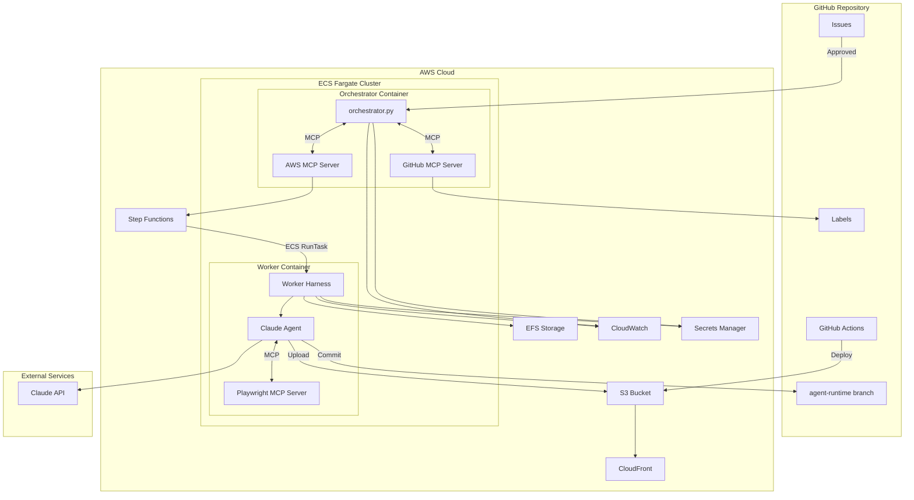
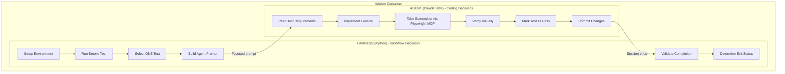
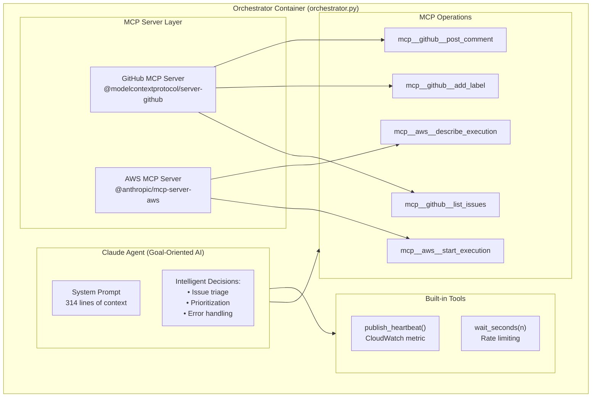
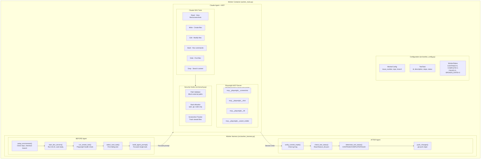
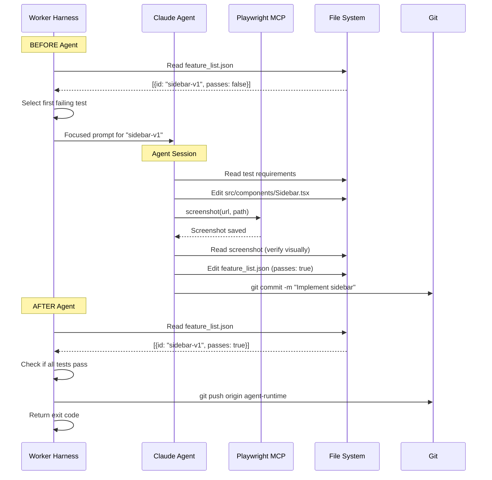
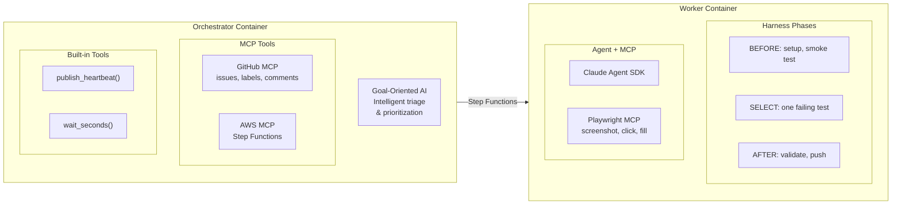
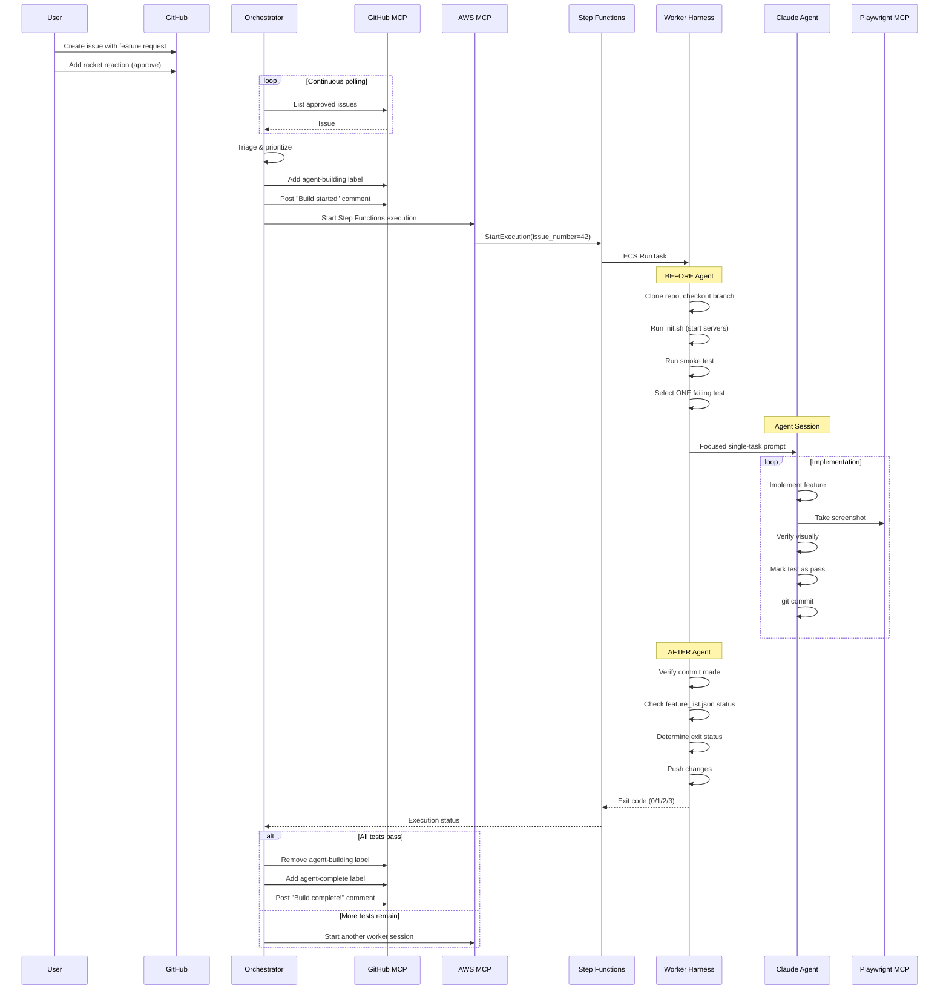
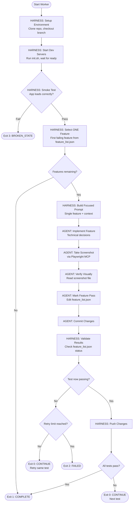
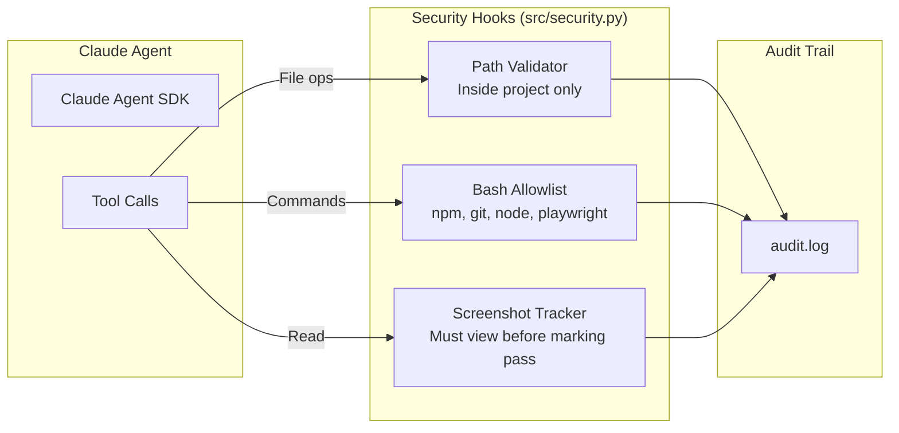

# Long-Horizon Coding Agent

An autonomous agent system that builds React applications from GitHub issues using Claude Agent SDK on AWS ECS/Fargate.

## Architecture

This system implements the **harness-enforced agent pattern** from Anthropic's ["Effective Harnesses for Long-Running Agents"](https://www.anthropic.com/engineering/effective-harnesses-for-long-running-agents) article, preventing common agent failure modes through code enforcement rather than prompt instructions.

### Agent Failure Mode Prevention

| Failure Mode | Problem | Harness Solution |
|--------------|---------|------------------|
| **Premature Completion** | Agent declares "done" after partial work | Harness validates all tests pass via feature_list.json |
| **Incomplete Implementation** | Half-finished features | Harness assigns ONE test per session |
| **Inadequate Testing** | Marks complete without verification | Harness validates screenshot exists + was viewed |
| **Inefficient Onboarding** | Wastes tokens on environment setup | Harness runs init.sh and smoke tests before agent |

### System Overview



### Harness-Enforced Worker Architecture

The key innovation is the **separation of concerns** between the harness and the agent:



**Harness Responsibilities:**
- Environment setup (clone, branch, dev servers)
- Smoke testing (fail fast if broken)
- Task selection (ONE test per session)
- Prompt construction (focused, single-task)
- Completion validation (reads feature_list.json)
- Exit status determination (CONTINUE, COMPLETE, FAILED)

**Agent Responsibilities:**
- Technical implementation decisions
- Code quality and visual design
- Tool usage (Playwright MCP for browser automation)
- When to commit

### Orchestrator Container Internals



### Worker Container Internals



### Data Flow: Test Implementation



### Container Responsibilities



## Issue-to-Build Flow



## Worker Exit Codes

The harness (not the agent) determines when work is complete:

| Exit Code | Status | Meaning | Next Action |
|-----------|--------|---------|-------------|
| 0 | `CONTINUE` | Test passed, more tests remain | Run another worker session |
| 1 | `COMPLETE` | All tests pass | Mark issue complete |
| 2 | `FAILED` | Unrecoverable error | Stop, post error comment |
| 3 | `BROKEN_STATE` | Smoke test failed | Stop, investigate |

## Worker Build Cycle (Harness-Enforced)



## Security Model



## MCP Server Configuration

### Orchestrator MCP Servers

| Server | Package | Purpose |
|--------|---------|---------|
| GitHub | `@modelcontextprotocol/server-github` | Issue operations, labels, comments |
| AWS | `@anthropic/mcp-server-aws` | Step Functions start/describe |

### Worker MCP Servers

| Server | Package | Purpose |
|--------|---------|---------|
| Playwright | `@anthropic/mcp-server-playwright` | Browser automation, screenshots |

## Component Reference

| Component | File | Description |
|-----------|------|-------------|
| **Orchestrator** | `orchestrator.py` | Long-running ECS service with GitHub/AWS MCP. Goal-oriented AI for intelligent issue triage |
| **Worker Harness** | `src/worker_harness.py` | Python harness enforcing agent workflow constraints |
| **Worker Config** | `src/worker_config.py` | Configuration dataclasses (`WorkerConfig`, `TestTask`, `WorkerStatus`) |
| **Worker Entry** | `worker_main.py` | Harness-based worker entry point |
| **Worker Agent** | `claude_code_agent.py` | Legacy entry point (backward compatibility) |
| **Security Hooks** | `src/security.py` | Path validation, bash allowlist, screenshot tracking |
| **ECS Stack** | `infrastructure/lib/ecs-cluster-stack.ts` | ECS cluster, task definitions |
| **Step Functions** | `infrastructure/lib/step-functions-stack.ts` | Worker invocation state machine |

## Quick Start

### Local Development

```bash
# Install dependencies
pip install -r requirements.txt

# Run worker directly (legacy mode)
python claude_code_agent.py --project canopy

# Run harness-based worker (requires env vars)
ISSUE_NUMBER=1 GITHUB_REPOSITORY=owner/repo python worker_main.py

# Run with Docker Compose
docker-compose up worker
```

### Environment Variables

```bash
# Required for worker
ISSUE_NUMBER=42
GITHUB_REPOSITORY=owner/repo

# Optional
PROVIDER=anthropic              # or "bedrock"
AGENT_BRANCH=agent-runtime      # git branch
ENVIRONMENT=local               # for secrets lookup
MAX_RETRIES_PER_TEST=3          # retry limit per test
SMOKE_TEST_TIMEOUT=30           # seconds
DEV_SERVER_PORT=6174            # dev server port
```

### Deploy to AWS

```bash
cd infrastructure
npm install
cdk deploy --all
```

## Project Structure

```
├── orchestrator.py              # Orchestrator with GitHub/AWS MCP
├── worker_main.py               # Harness-based worker entry point
├── claude_code_agent.py         # Legacy worker entry point
├── src/
│   ├── worker_harness.py        # Harness enforcing agent constraints
│   ├── worker_config.py         # Worker configuration dataclasses
│   ├── secrets.py               # AWS Secrets Manager utilities
│   ├── github_integration.py    # GitHub API operations
│   ├── security.py              # Security hooks
│   ├── cloudwatch_metrics.py    # Heartbeat metrics
│   └── git_manager.py           # Git operations
├── infrastructure/
│   ├── lib/
│   │   ├── claude-code-stack.ts      # Core infrastructure
│   │   ├── ecs-cluster-stack.ts      # ECS cluster + tasks
│   │   └── step-functions-stack.ts   # Worker state machine
│   └── bin/
│       └── claude-code-infrastructure.ts
├── prompts/
│   ├── system_prompt.txt             # Full system prompt (legacy)
│   ├── worker_system_prompt.txt      # Simplified worker prompt
│   └── canopy/BUILD_PLAN.md          # Project specification
├── Dockerfile.orchestrator      # Orchestrator image (Node.js for MCP)
├── Dockerfile.worker            # Worker image (Node.js for MCP)
└── .github/workflows/
    ├── agent-builder.yml        # Start worker via Step Functions
    ├── stop-agent-on-close.yml  # Cleanup on issue close
    └── deploy-preview.yml       # Deploy to CloudFront
```

## Key Design Principles

1. **Harness responsibility:** Tool access, context management, session structure, state preservation, completion validation
2. **Agent responsibility:** Technical decisions, feature implementation, quality assessment

> The agent makes **coding decisions**. The harness makes **workflow decisions**.

## License

Apache 2.0
