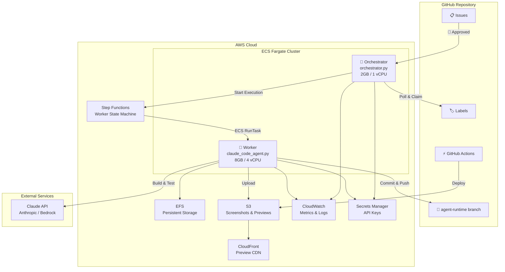
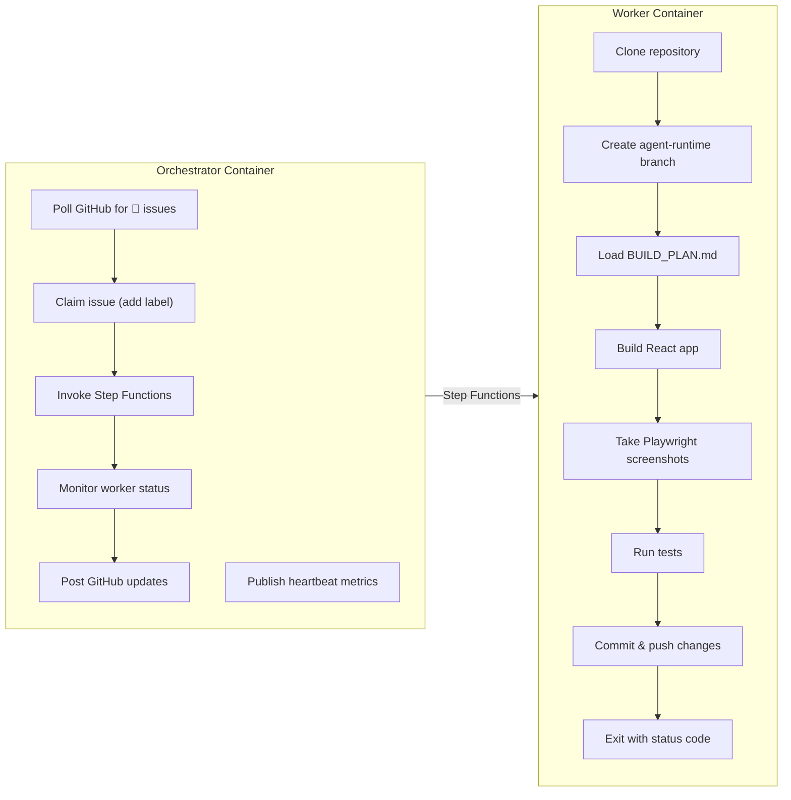
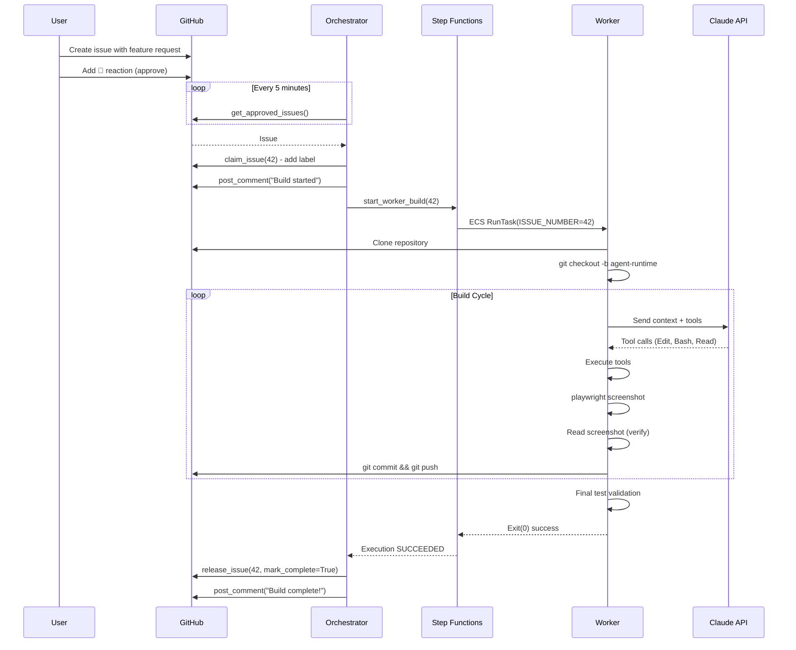
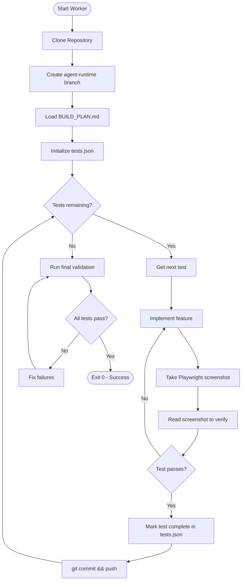
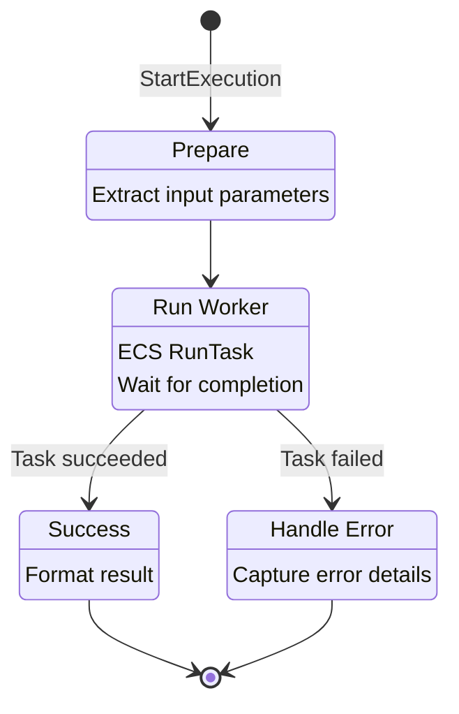
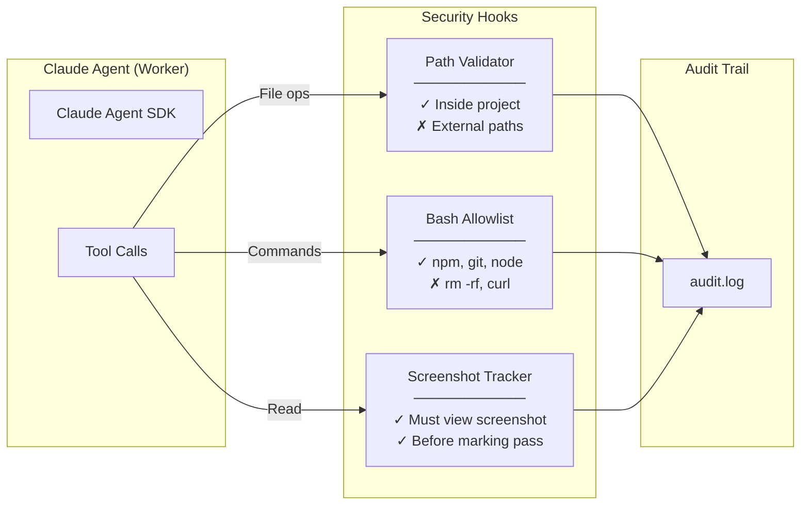

# Long-Horizon Coding Agent

An autonomous agent system that builds React applications from GitHub issues using Claude Agent SDK on AWS ECS/Fargate.

## Architecture

### System Overview



### Container Responsibilities



## Issue-to-Build Flow



## Worker Build Cycle



## Step Functions State Machine



## Security Model



## Component Reference

| Component | File | Description |
|-----------|------|-------------|
| **Orchestrator** | `orchestrator.py` | Long-running ECS service. Polls GitHub, claims issues, invokes workers via Step Functions |
| **Worker** | `claude_code_agent.py` | On-demand ECS task. Builds features using Claude Agent SDK |
| **ECS Stack** | `infrastructure/lib/ecs-cluster-stack.ts` | ECS cluster, task definitions, security groups |
| **Step Functions** | `infrastructure/lib/step-functions-stack.ts` | Worker invocation state machine |
| **Core Infra** | `infrastructure/lib/claude-code-stack.ts` | VPC, ECR, EFS, S3, CloudFront, Secrets |

## Quick Start

### Local Development

```bash
# Install dependencies
pip install -r requirements.txt

# Run worker directly
python claude_code_agent.py --project canopy

# Run with Docker Compose
docker-compose up worker
```

### Environment Variables

```bash
# Required
ANTHROPIC_API_KEY=sk-ant-...
GITHUB_TOKEN=ghp_...
GITHUB_REPOSITORY=owner/repo

# Optional
PROVIDER=anthropic          # or "bedrock"
ENVIRONMENT=local
ISSUE_NUMBER=1              # for worker mode
```

### Deploy to AWS

```bash
cd infrastructure
npm install
cdk deploy --all
```

## Project Structure

```
├── orchestrator.py              # Orchestrator container entrypoint
├── claude_code_agent.py         # Worker container entrypoint
├── src/
│   ├── secrets.py               # AWS Secrets Manager utilities
│   ├── github_integration.py    # GitHub API operations
│   ├── security.py              # Security hooks
│   ├── cloudwatch_metrics.py    # Heartbeat metrics
│   └── git_manager.py           # Git operations
├── infrastructure/
│   ├── lib/
│   │   ├── claude-code-stack.ts      # Core infrastructure
│   │   ├── ecs-cluster-stack.ts      # ECS cluster + tasks
│   │   └── step-functions-stack.ts   # Worker state machine
│   └── bin/
│       └── claude-code-infrastructure.ts
├── prompts/
│   └── canopy/BUILD_PLAN.md     # Project specification
├── Dockerfile.orchestrator      # Orchestrator image
├── Dockerfile.worker            # Worker image
└── .github/workflows/
    ├── agent-builder.yml        # Start worker via Step Functions
    ├── stop-agent-on-close.yml  # Cleanup on issue close
    └── deploy-preview.yml       # Deploy to CloudFront
```

## License

Apache 2.0
