# 🤖 Long-Horizon Coding Agent Demo

An autonomous agent system that builds React applications from GitHub issues using AWS Bedrock AgentCore and the Claude Agent SDK. Demonstrated at AWS re:Invent 2025.

## Architecture

### System Overview

```mermaid
flowchart TB
    subgraph GitHub["GitHub Repository"]
        Issues["📋 Issues<br/>(Feature Requests)"]
        Actions["⚡ GitHub Actions"]
        Labels["🏷️ Labels<br/>(agent-building, agent-complete)"]
    end

    subgraph AWS["AWS Cloud"]
        subgraph AgentCore["Bedrock AgentCore"]
            Entrypoint["bedrock_entrypoint.py<br/>(Orchestrator)"]
            Agent["claude_code.py<br/>(Session Manager)"]
            SDK["Claude Agent SDK"]
        end

        ECS["ECS Fargate"]
        EFS["EFS<br/>(Persistent Storage)"]
        ECR["ECR<br/>(Container Registry)"]
        CW["CloudWatch<br/>(Metrics & Logs)"]
        SM["Secrets Manager<br/>(API Keys)"]
        CF["CloudFront<br/>(Preview CDN)"]
        S3["S3<br/>(Preview Assets)"]
    end

    subgraph LocalDev["Local Development"]
        CLI["python claude_code.py"]
        Config[".claude-code.json"]
    end

    Issues -->|"🚀 Approved"| Actions
    Actions -->|"Invoke"| AgentCore
    AgentCore --> ECS
    ECS --> EFS
    ECS --> ECR
    Entrypoint --> Agent
    Agent --> SDK
    Agent -->|"Heartbeat"| CW
    Entrypoint -->|"Fetch secrets"| SM
    Agent -->|"Update labels"| Labels
    Agent -->|"Post comments"| Issues
    Actions -->|"Deploy"| S3
    S3 --> CF

    CLI --> Agent
    Config --> CLI
```



### Issue-to-Deployment Workflow

```mermaid
sequenceDiagram
    participant User
    participant GitHub as GitHub Issues
    participant Poller as Issue Poller<br/>(every 5 min)
    participant Builder as Agent Builder
    participant AgentCore as Bedrock AgentCore
    participant Agent as Claude Agent
    participant Deploy as Deploy Preview

    User->>GitHub: Create issue with feature request
    User->>GitHub: Vote with 👍
    User->>GitHub: Approve with 🚀

    Poller->>GitHub: Check for approved issues
    GitHub-->>Poller: Return approved issues (sorted by votes)
    Poller->>Builder: Trigger build for top issue

    Builder->>GitHub: Add "agent-building" label
    Builder->>AgentCore: Invoke with issue number

    AgentCore->>Agent: Start session

    loop Build Loop
        Agent->>Agent: Read BUILD_PLAN.md
        Agent->>Agent: Implement feature
        Agent->>Agent: Take screenshots
        Agent->>Agent: Run tests
        Agent->>GitHub: Push commits
        Agent->>GitHub: Post progress comment
    end

    Agent->>GitHub: Signal completion 🎉
    Agent->>GitHub: Remove "agent-building"
    Agent->>GitHub: Add "agent-complete"

    Deploy->>GitHub: Triggered by label
    Deploy->>Deploy: Build & deploy to CloudFront
    Deploy->>GitHub: Post preview URL
```



### Security Model

```mermaid
flowchart LR
    subgraph Agent["Claude Agent"]
        SDK["Claude SDK"]
        Tools["Tool Calls"]
    end

    subgraph Hooks["Security Hooks (src/security.py)"]
        PathHook["universal_path_security_hook<br/>━━━━━━━━━━━━━━━━━━━<br/>✓ Validate paths inside project<br/>✗ Block external file access"]
        BashHook["bash_security_hook<br/>━━━━━━━━━━━━━━━━━━━<br/>✓ Allowlist: npm, git, node...<br/>✗ Block: rm -rf, curl, wget..."]
        TestHook["track_read_hook<br/>━━━━━━━━━━━━━━━━━━━<br/>✓ Track screenshot reads<br/>✓ Verify before test pass"]
    end

    subgraph Audit["Audit Trail"]
        AuditLog["audit.log<br/>(JSON-parseable)"]
    end

    Tools -->|"File ops"| PathHook
    Tools -->|"Bash cmds"| BashHook
    Tools -->|"Read files"| TestHook

    PathHook -->|"Log blocked"| AuditLog
    BashHook -->|"Log blocked"| AuditLog
    TestHook -->|"Log access"| AuditLog

    PathHook -->|"✓ Allowed"| Execute["Execute Tool"]
    BashHook -->|"✓ Allowed"| Execute
```



### Session State Machine

```mermaid
stateDiagram-v2
    [*] --> continuous: Start agent

    continuous --> continuous: Process issue
    continuous --> run_once: Single task mode
    continuous --> pause: Completion signal 🎉
    continuous --> terminated: Error/timeout

    run_once --> continuous: More issues
    run_once --> pause: No more issues
    run_once --> terminated: Error

    pause --> continuous: Resume (new issue)
    pause --> run_cleanup: Cleanup requested
    pause --> terminated: Stop command

    run_cleanup --> pause: Cleanup done
    run_cleanup --> terminated: Error

    terminated --> [*]

    note right of continuous
        Active processing
        - Building features
        - Running tests
        - Pushing commits
    end note

    note right of pause
        Idle state
        - Waiting for new issues
        - Mission Control can resume
    end note

    note right of run_cleanup
        Technical debt removal
        - Refactoring
        - Dead code cleanup
    end note
```



## How It Works

### End-to-End Flow

1. **User creates GitHub issue** with a feature request
2. **Users vote** with 👍 reactions to prioritize what gets built
3. **Authorized user approves** by adding a 🚀 reaction
4. **Issue poller** (runs every 5 min) detects approved issues, sorted by votes
5. **Agent builder** workflow acquires lock and invokes AWS Bedrock AgentCore
6. **Bedrock entrypoint** clones the repo and starts the Claude agent
7. **Agent builds the feature** following the build plan, taking screenshots, running tests
8. **Progress is tracked** via commits pushed to the `agent-runtime` branch
9. **Screenshots and updates are posted** to the GitHub issue
10. **On completion**, the agent signals done, commits are pushed, and `agent-complete` label is added
11. **If more issues exist**, the agent continues in enhancement mode
12. **Deploy preview** workflow builds and deploys to CloudFront

## Key Features

- **Vote-based prioritization** - Issues with more 👍 reactions are built first
- **Health monitoring** - CloudWatch heartbeat detects stale sessions and triggers auto-restart
- **Incremental builds** - Agent builds new features on top of existing generated code
- **Screenshot capture** - Playwright takes screenshots throughout development
- **Live previews** - Each issue gets a CloudFront preview URL

## Configuration

### Prerequisites

- AWS account with Bedrock AgentCore access
- GitHub repository with Actions enabled
- Docker for local development

### AWS Configuration

1. Copy `.bedrock_agentcore.yaml.template` to `.bedrock_agentcore.yaml`
2. Fill in your AWS values:

| Value | Description | Example |
|-------|-------------|---------|
| `YOUR_ACCOUNT_ID` | Your AWS account ID | `123456789012` |
| `YOUR_EXECUTION_ROLE` | IAM role for AgentCore runtime | `AmazonBedrockAgentCoreSDKRuntime-...` |
| `YOUR_PROJECT_NAME` | ECR repository name | `my-agent` |
| `YOUR_AGENT_RUNTIME_ID` | AgentCore runtime ID (after first deploy) | `my_agent-abc123` |
| `YOUR_CODEBUILD_ROLE` | IAM role for CodeBuild | `AmazonBedrockAgentCoreSDKCodeBuild-...` |

### GitHub Repository Secrets

Configure in Settings → Secrets and variables → Actions → Secrets:

| Secret | Description |
|--------|-------------|
| `AWS_ACCESS_KEY_ID` | IAM user access key for GitHub Actions |
| `AWS_SECRET_ACCESS_KEY` | IAM user secret key |
| `AWS_AGENTCORE_ROLE_ARN` | IAM role ARN for invoking AgentCore |
| `AWS_PREVIEW_DEPLOY_ROLE_ARN` | IAM role ARN for deploying previews |

### GitHub Repository Variables

Configure in Settings → Secrets and variables → Actions → Variables:

| Variable | Description |
|----------|-------------|
| `AUTHORIZED_APPROVERS` | Comma-separated GitHub usernames who can approve builds with 🚀 |
| `PREVIEWS_BUCKET_NAME` | S3 bucket for preview deployments |
| `PREVIEWS_CDN_DOMAIN` | CloudFront domain for previews |
| `PREVIEWS_DISTRIBUTION_ID` | CloudFront distribution ID for cache invalidation |

### GitHub Repository Labels

The following labels must exist for the workflows to function properly:

| Label | Color | Description |
|-------|-------|-------------|
| `agent-building` | `#FBCA04` (yellow) | Agent is actively working on this issue |
| `agent-complete` | `#0E8A16` (green) | Agent has completed this issue |
| `tests-failed` | `#D93F0B` (red) | Tests failed during agent build |

Create these at Settings → Labels, or via CLI:
```bash
gh api repos/OWNER/REPO/labels -f name="agent-building" -f color="FBCA04" -f description="Agent is actively working on this issue"
gh api repos/OWNER/REPO/labels -f name="agent-complete" -f color="0E8A16" -f description="Agent has completed this issue"
gh api repos/OWNER/REPO/labels -f name="tests-failed" -f color="D93F0B" -f description="Tests failed during agent build"
```

### AWS Secrets Manager

The agent reads secrets from AWS Secrets Manager. Required secrets:

| Secret Name | Description |
|-------------|-------------|
| `claude-code/{env}/anthropic-api-key` | Anthropic API key for Claude |
| `claude-code/{env}/github-token` | Default GitHub PAT (fallback) |
| `claude-code/{env}/github-token-{org}` | Org-specific GitHub PAT (optional) |

Where `{env}` is the environment name (default: `reinvent`) and `{org}` is the GitHub organization name.

**Org-specific tokens** allow separation of concerns when working with multiple GitHub organizations. The agent checks for an org-specific token first, then falls back to the default:

```bash
# Create org-specific token (recommended for multi-org setups)
aws secretsmanager create-secret \
  --name claude-code/reinvent/github-token-anthropics \
  --secret-string "ghp_your_pat_here" \
  --region us-west-2

# Or update existing default token
aws secretsmanager update-secret \
  --secret-id claude-code/reinvent/github-token \
  --secret-string "ghp_your_pat_here" \
  --region us-west-2
```

## Project Structure

```
├── bedrock_entrypoint.py    # Main orchestrator for AWS Bedrock AgentCore
├── claude_code.py           # Agent session manager and local runner
├── src/                     # Python modules
│   ├── cloudwatch_metrics.py  # Heartbeat and metrics
│   ├── github_integration.py  # GitHub API operations
│   └── git_operations.py      # Git commit/push logic
├── prompts/                 # Build plans and system prompts
│   └── canopy/              # Project Management app build plan
├── frontend-scaffold-template/  # React + Vite + Tailwind scaffold
└── .github/workflows/       # GitHub Actions
    ├── issue-poller.yml     # Polls for approved issues
    ├── agent-builder.yml    # Invokes AgentCore
    └── deploy-preview.yml   # Deploys to CloudFront
```

## License

MIT
