# Long-Horizon Coding Agent

An autonomous agent system that builds React applications from GitHub issues using Claude Agent SDK on AWS ECS/Fargate.

## Architecture

### System Overview

```mermaid
flowchart TB
    subgraph GitHub["GitHub Repository"]
        Issues["📋 Issues"]
        Labels["🏷️ Labels"]
        Branch["🌿 agent-runtime branch"]
        Actions["⚡ GitHub Actions"]
    end

    subgraph AWS["AWS Cloud"]
        subgraph ECS["ECS Fargate Cluster"]
            Orch["🎯 Orchestrator<br/>orchestrator.py<br/>2GB / 1 vCPU"]
            Worker["🔨 Worker<br/>claude_code_agent.py<br/>8GB / 4 vCPU"]
        end

        SFN["Step Functions<br/>Worker State Machine"]
        EFS["EFS<br/>Persistent Storage"]
        S3["S3<br/>Screenshots & Previews"]
        CF["CloudFront<br/>Preview CDN"]
        CW["CloudWatch<br/>Metrics & Logs"]
        SM["Secrets Manager<br/>API Keys"]
    end

    subgraph External["External Services"]
        Claude["Claude API<br/>Anthropic / Bedrock"]
    end

    Issues -->|"🚀 Approved"| Orch
    Orch -->|"Poll & Claim"| Labels
    Orch -->|"Start Execution"| SFN
    SFN -->|"ECS RunTask"| Worker
    Worker -->|"Build & Test"| Claude
    Worker -->|"Commit & Push"| Branch
    Worker -->|"Upload"| S3
    S3 --> CF
    Worker --> EFS
    Orch --> CW
    Worker --> CW
    Orch --> SM
    Worker --> SM
    Actions -->|"Deploy"| S3
```



### Container Responsibilities

```mermaid
flowchart LR
    subgraph Orchestrator["Orchestrator Container"]
        O1["Poll GitHub for 🚀 issues"]
        O2["Claim issue (add label)"]
        O3["Invoke Step Functions"]
        O4["Monitor worker status"]
        O5["Post GitHub updates"]
        O6["Publish heartbeat metrics"]
        O1 --> O2 --> O3 --> O4 --> O5
        O6
    end

    subgraph Worker["Worker Container"]
        W1["Clone repository"]
        W2["Create agent-runtime branch"]
        W3["Load BUILD_PLAN.md"]
        W4["Build React app"]
        W5["Take Playwright screenshots"]
        W6["Run tests"]
        W7["Commit & push changes"]
        W8["Exit with status code"]
        W1 --> W2 --> W3 --> W4 --> W5 --> W6 --> W7 --> W8
    end

    Orchestrator -->|"Step Functions"| Worker
```



## Issue-to-Build Flow

```mermaid
sequenceDiagram
    participant User
    participant GitHub
    participant Orchestrator
    participant StepFunctions as Step Functions
    participant Worker
    participant Claude as Claude API

    User->>GitHub: Create issue with feature request
    User->>GitHub: Add 🚀 reaction (approve)

    loop Every 5 minutes
        Orchestrator->>GitHub: get_approved_issues()
    end

    GitHub-->>Orchestrator: Issue #42 approved
    Orchestrator->>GitHub: claim_issue(42) - add label
    Orchestrator->>GitHub: post_comment("Build started")
    Orchestrator->>StepFunctions: start_worker_build(42)

    StepFunctions->>Worker: ECS RunTask(ISSUE_NUMBER=42)

    Worker->>GitHub: Clone repository
    Worker->>Worker: git checkout -b agent-runtime

    loop Build Cycle
        Worker->>Claude: Send context + tools
        Claude-->>Worker: Tool calls (Edit, Bash, Read)
        Worker->>Worker: Execute tools
        Worker->>Worker: playwright screenshot
        Worker->>Worker: Read screenshot (verify)
        Worker->>GitHub: git commit && git push
    end

    Worker->>Worker: Final test validation
    Worker-->>StepFunctions: Exit(0) success

    StepFunctions-->>Orchestrator: Execution SUCCEEDED
    Orchestrator->>GitHub: release_issue(42, mark_complete=True)
    Orchestrator->>GitHub: post_comment("Build complete!")
```



## Worker Build Cycle


## Step Functions State Machine


## Security Model

```mermaid
flowchart LR
    subgraph Agent["Claude Agent (Worker)"]
        SDK["Claude Agent SDK"]
        Tools["Tool Calls"]
    end

    subgraph Hooks["Security Hooks"]
        PathHook["Path Validator<br/>───────────<br/>✓ Inside project<br/>✗ External paths"]
        BashHook["Bash Allowlist<br/>───────────<br/>✓ npm, git, node<br/>✗ rm -rf, curl"]
        TestHook["Screenshot Tracker<br/>───────────<br/>✓ Must view screenshot<br/>✓ Before marking pass"]
    end

    subgraph Audit["Audit Trail"]
        Log["audit.log"]
    end

    Tools -->|"File ops"| PathHook
    Tools -->|"Commands"| BashHook
    Tools -->|"Read"| TestHook

    PathHook --> Log
    BashHook --> Log
    TestHook --> Log
```



## Component Reference

| Component | File | Description |
|-----------|------|-------------|
| **Orchestrator** | `orchestrator.py` | Long-running ECS service. Polls GitHub, claims issues, invokes workers via Step Functions |
| **Worker** | `claude_code_agent.py` | On-demand ECS task. Builds features using Claude Agent SDK |
| **ECS Stack** | `infrastructure/lib/ecs-cluster-stack.ts` | ECS cluster, task definitions, security groups |
| **Step Functions** | `infrastructure/lib/step-functions-stack.ts` | Worker invocation state machine |
| **Core Infra** | `infrastructure/lib/claude-code-stack.ts` | VPC, ECR, EFS, S3, CloudFront, Secrets |

## Quick Start

### Local Development

```bash
# Install dependencies
pip install -r requirements.txt

# Run worker directly
python claude_code_agent.py --project canopy

# Run with Docker Compose
docker-compose up worker
```

### Environment Variables

```bash
# Required
ANTHROPIC_API_KEY=sk-ant-...
GITHUB_TOKEN=ghp_...
GITHUB_REPOSITORY=owner/repo

# Optional
PROVIDER=anthropic          # or "bedrock"
ENVIRONMENT=local
ISSUE_NUMBER=1              # for worker mode
```

### Deploy to AWS

```bash
cd infrastructure
npm install
cdk deploy --all
```

## Project Structure

```
├── orchestrator.py              # Orchestrator container entrypoint
├── claude_code_agent.py         # Worker container entrypoint
├── src/
│   ├── secrets.py               # AWS Secrets Manager utilities
│   ├── github_integration.py    # GitHub API operations
│   ├── security.py              # Security hooks
│   ├── cloudwatch_metrics.py    # Heartbeat metrics
│   └── git_manager.py           # Git operations
├── infrastructure/
│   ├── lib/
│   │   ├── claude-code-stack.ts      # Core infrastructure
│   │   ├── ecs-cluster-stack.ts      # ECS cluster + tasks
│   │   └── step-functions-stack.ts   # Worker state machine
│   └── bin/
│       └── claude-code-infrastructure.ts
├── prompts/
│   └── canopy/BUILD_PLAN.md     # Project specification
├── Dockerfile.orchestrator      # Orchestrator image
├── Dockerfile.worker            # Worker image
└── .github/workflows/
    ├── agent-builder.yml        # Start worker via Step Functions
    ├── stop-agent-on-close.yml  # Cleanup on issue close
    └── deploy-preview.yml       # Deploy to CloudFront
```

## License

Apache 2.0
