# 🤖 Long-Horizon Coding Agent Demo

An autonomous agent system that builds React applications from GitHub issues using AWS Bedrock AgentCore and the Claude Agent SDK. Demonstrated at AWS re:Invent 2025.

## Architecture

### System Overview

```mermaid
flowchart TB
    subgraph GitHub["GitHub Repository"]
        Issues["📋 Issues<br/>(Feature Requests)"]
        Actions["⚡ GitHub Actions"]
        Labels["🏷️ Labels<br/>(agent-building, agent-complete)"]
    end

    subgraph AWS["AWS Cloud"]
        subgraph AgentCore["Bedrock AgentCore"]
            Entrypoint["aws_runner.py<br/>(Orchestrator)"]
            Agent["agent.py<br/>(Session Manager)"]
            SDK["Claude Agent SDK"]
        end

        ECS["ECS Fargate"]
        EFS["EFS<br/>(Persistent Storage)"]
        ECR["ECR<br/>(Container Registry)"]
        CW["CloudWatch<br/>(Metrics & Logs)"]
        SM["Secrets Manager<br/>(API Keys)"]
        CF["CloudFront<br/>(Preview CDN)"]
        S3["S3<br/>(Preview Assets)"]
    end

    subgraph LocalDev["Local Development"]
        CLI["python agent.py"]
        Config[".claude-code.json"]
    end

    Issues -->|"🚀 Approved"| Actions
    Actions -->|"Invoke"| AgentCore
    AgentCore --> ECS
    ECS --> EFS
    ECS --> ECR
    Entrypoint --> Agent
    Agent --> SDK
    Agent -->|"Heartbeat"| CW
    Entrypoint -->|"Fetch secrets"| SM
    Agent -->|"Update labels"| Labels
    Agent -->|"Post comments"| Issues
    Actions -->|"Deploy"| S3
    S3 --> CF

    CLI --> Agent
    Config --> CLI
```



### Issue-to-Deployment Workflow

```mermaid
sequenceDiagram
    participant User
    participant GitHub as GitHub Issues
    participant Poller as Issue Poller<br/>(every 5 min)
    participant Builder as Agent Builder
    participant AgentCore as Bedrock AgentCore
    participant Agent as Claude Agent
    participant Deploy as Deploy Preview

    User->>GitHub: Create issue with feature request
    User->>GitHub: Vote with 👍
    User->>GitHub: Approve with 🚀

    Poller->>GitHub: Check for approved issues
    GitHub-->>Poller: Return approved issues (sorted by votes)
    Poller->>Builder: Trigger build for top issue

    Builder->>GitHub: Add "agent-building" label
    Builder->>AgentCore: Invoke with issue number

    AgentCore->>Agent: Start session

    loop Build Loop
        Agent->>Agent: Read BUILD_PLAN.md
        Agent->>Agent: Implement feature
        Agent->>Agent: Take screenshots
        Agent->>Agent: Run tests
        Agent->>GitHub: Push commits
        Agent->>GitHub: Post progress comment
    end

    Agent->>GitHub: Signal completion 🎉
    Agent->>GitHub: Remove "agent-building"
    Agent->>GitHub: Add "agent-complete"

    Deploy->>GitHub: Triggered by label
    Deploy->>Deploy: Build & deploy to CloudFront
    Deploy->>GitHub: Post preview URL
```



### Security Model

```mermaid
flowchart LR
    subgraph Agent["Claude Agent"]
        SDK["Claude SDK"]
        Tools["Tool Calls"]
    end

    subgraph Hooks["Security Hooks (src/security.py)"]
        PathHook["universal_path_security_hook<br/>━━━━━━━━━━━━━━━━━━━<br/>✓ Validate paths inside project<br/>✗ Block external file access"]
        BashHook["bash_security_hook<br/>━━━━━━━━━━━━━━━━━━━<br/>✓ Allowlist: npm, git, node...<br/>✗ Block: rm -rf, curl, wget..."]
        TestHook["track_read_hook<br/>━━━━━━━━━━━━━━━━━━━<br/>✓ Track screenshot reads<br/>✓ Verify before test pass"]
    end

    subgraph Audit["Audit Trail"]
        AuditLog["audit.log<br/>(JSON-parseable)"]
    end

    Tools -->|"File ops"| PathHook
    Tools -->|"Bash cmds"| BashHook
    Tools -->|"Read files"| TestHook

    PathHook -->|"Log blocked"| AuditLog
    BashHook -->|"Log blocked"| AuditLog
    TestHook -->|"Log access"| AuditLog

    PathHook -->|"✓ Allowed"| Execute["Execute Tool"]
    BashHook -->|"✓ Allowed"| Execute
```



### Session State Machine

```mermaid
stateDiagram-v2
    [*] --> continuous: Start agent

    continuous --> continuous: Process issue
    continuous --> run_once: Single task mode
    continuous --> pause: Completion signal 🎉
    continuous --> terminated: Error/timeout

    run_once --> continuous: More issues
    run_once --> pause: No more issues
    run_once --> terminated: Error

    pause --> continuous: Resume (new issue)
    pause --> run_cleanup: Cleanup requested
    pause --> terminated: Stop command

    run_cleanup --> pause: Cleanup done
    run_cleanup --> terminated: Error

    terminated --> [*]

    note right of continuous
        Active processing
        - Building features
        - Running tests
        - Pushing commits
    end note

    note right of pause
        Idle state
        - Waiting for new issues
        - Mission Control can resume
    end note

    note right of run_cleanup
        Technical debt removal
        - Refactoring
        - Dead code cleanup
    end note
```



## How It Works

### End-to-End Flow

1. **User creates GitHub issue** with a feature request
2. **Users vote** with 👍 reactions to prioritize what gets built
3. **Authorized user approves** by adding a 🚀 reaction
4. **Issue poller** (runs every 5 min) detects approved issues, sorted by votes
5. **Agent builder** workflow acquires lock and invokes AWS Bedrock AgentCore
6. **Bedrock entrypoint** clones the repo and starts the Claude agent
7. **Agent builds the feature** following the build plan, taking screenshots, running tests
8. **Progress is tracked** via commits pushed to the `agent-runtime` branch
9. **Screenshots and updates are posted** to the GitHub issue
10. **On completion**, the agent signals done, commits are pushed, and `agent-complete` label is added
11. **If more issues exist**, the agent continues in enhancement mode
12. **Deploy preview** workflow builds and deploys to CloudFront

### Repository Setup (GitHub Mode)

In GitHub mode, the agent clones your target repository and builds from scratch:

```mermaid
sequenceDiagram
    participant Repo as Target Repo
    participant Entry as aws_runner.py
    participant Agent as agent.py

    Note over Repo: Requirements:<br/>✓ Git initialized<br/>✓ Main branch exists

    Entry->>Repo: Clone repository
    Entry->>Entry: Create agent-runtime branch
    Entry->>Entry: mkdir generated-app/ (empty)
    Entry->>Entry: Install post-commit hook
    Entry->>Agent: Start session
    Agent->>Agent: Read BUILD_PLAN.md
    Agent->>Agent: Build React app from scratch
    Agent->>Repo: Auto-push commits
```



**Key points:**
- Target repo needs only git initialized with a main branch
- `frontend-scaffold-template/` is **not used** in GitHub mode (only local mode)
- Agent creates empty `generated-app/` and builds everything from the `BUILD_PLAN.md` spec

See [GitHub Mode Setup](docs/how-to/github-mode-setup.md) for detailed requirements and troubleshooting.

## Key Features

- **Vote-based prioritization** - Issues with more 👍 reactions are built first
- **Health monitoring** - CloudWatch heartbeat detects stale sessions and triggers auto-restart
- **Incremental builds** - Agent builds new features on top of existing generated code
- **Screenshot capture** - Playwright takes screenshots throughout development
- **Live previews** - Each issue gets a CloudFront preview URL

## Quick Start

### Prerequisites

- AWS account with Bedrock AgentCore access
- GitHub repository with Actions enabled
- Python 3.11+ with `uv`

### 1. Install Dependencies

```bash
uv pip install -r requirements.txt
```

### 2. Configure Provider

Run the interactive setup wizard:

```bash
uv run python install.py
```

Select your provider (Anthropic or AWS Bedrock) and follow the prompts.

### 3. Configure GitHub Repository

Set up secrets, variables, and labels for GitHub Actions integration.

See [Configure GitHub Repository](docs/how-to/configure-github-repository.md) for detailed instructions.

### 4. Run Locally

```bash
uv run python agent.py --project canopy
```

## Documentation

Detailed how-to guides are available in the [`docs/how-to/`](docs/how-to/) directory:

| Guide | Description |
|-------|-------------|
| [Getting Started](docs/how-to/getting-started.md) | Setup paths for local development and production |
| [Set Up AWS Bedrock Provider](docs/how-to/setup-bedrock-provider.md) | Configure the agent to use Amazon Bedrock |
| [Configure GitHub Repository](docs/how-to/configure-github-repository.md) | Set up secrets, variables, labels, and AWS Secrets Manager |

### Additional Resources

- [Infrastructure Deployment (CDK)](infrastructure/README.md) - Deploy AWS infrastructure

## Project Structure

```
├── aws_runner.py            # Main orchestrator for AWS Bedrock AgentCore
├── agent.py                 # Agent session manager and local runner
├── src/                     # Python modules
│   ├── cloudwatch_metrics.py  # Heartbeat and metrics
│   ├── github_integration.py  # GitHub API operations
│   └── git_operations.py      # Git commit/push logic
├── prompts/                 # Build plans and system prompts
│   └── canopy/              # Project Management app build plan
├── frontend-scaffold-template/  # React + Vite + Tailwind scaffold
└── .github/workflows/       # GitHub Actions
    ├── issue-poller.yml     # Polls for approved issues
    ├── agent-builder.yml    # Invokes AgentCore
    └── deploy-preview.yml   # Deploys to CloudFront
```

## License

MIT
