# Technical Requirements Document: Claude Code Agent Enhancements

**Created**: 2025-12-03
**Version**: 1.0
**Complexity**: Medium (brownfield enhancements)
**Source**: epcc-features.json (16 features from code review)

---

## Executive Summary

Technical enhancements to existing Python-based autonomous agent system. Focus areas: testing infrastructure, type safety, reliability (retry logic), observability (audit trail, tracing), and developer experience (CLI flags, documentation).

## Existing Architecture

### Current Stack
| Component | Technology | Notes |
|-----------|------------|-------|
| **Language** | Python 3.11+ | Type hints partially used |
| **Agent SDK** | claude-agent-sdk | Core agent functionality |
| **AWS Integration** | boto3 | Bedrock, CloudWatch, Secrets Manager |
| **GitHub** | PyGithub | Issue tracking, comments |
| **Observability** | opentelemetry-api | Imported but not configured |
| **CLI** | questionary, rich | Interactive installer |

### Module Structure
```
src/
├── config.py          # Configuration, Provider enum, ProjectConfig dataclass
├── security.py        # Pre/Post tool hooks, path validation, bash allowlist
├── git_manager.py     # Git operations, post-commit hooks
├── github_integration.py  # Issue lifecycle, labels, reactions
├── session_manager.py # Session setup, prompt templating
├── token_tracker.py   # Cost tracking, limits
├── cloudwatch_metrics.py  # CloudWatch publisher
└── logging_utils.py   # Timestamped logging
```

### Entry Points
- `install.py` - Interactive setup wizard
- `claude_code.py` - Core agent session manager
- `bedrock_entrypoint.py` - AWS AgentCore wrapper

---

## Technical Approach by Feature Category

### Category 1: Testing Infrastructure (F001, F013)

**Tools to Add:**
| Tool | Version | Purpose |
|------|---------|---------|
| pytest | ^8.0 | Test runner |
| pytest-cov | ^4.0 | Coverage reporting |
| pytest-asyncio | ^0.23 | Async test support |
| pre-commit | ^3.6 | Git hooks |
| black | ^24.0 | Code formatting |
| ruff | ^0.1 | Fast linting |
| mypy | ^1.8 | Type checking |

**Directory Structure:**
```
tests/
├── __init__.py
├── conftest.py           # Shared fixtures
├── test_config.py        # Config loading, provider detection
├── test_security.py      # Path validation, bash allowlist
├── test_git_manager.py   # Git operations (mocked)
├── test_retry.py         # Retry logic (F003)
└── test_audit.py         # Audit logging (F004)
```

**Configuration File: pyproject.toml**
```toml
[project]
name = "claude-code-agent"
version = "0.1.0"
requires-python = ">=3.11"

[tool.pytest.ini_options]
testpaths = ["tests"]
asyncio_mode = "auto"
addopts = "-v --cov=src --cov-report=html"

[tool.mypy]
strict = true
python_version = "3.11"
warn_return_any = true
warn_unused_configs = true

[tool.black]
line-length = 88
target-version = ["py311"]

[tool.ruff]
line-length = 88
select = ["E", "F", "I", "N", "W", "UP"]
```

**Pre-commit Config: .pre-commit-config.yaml**
```yaml
repos:
  - repo: https://github.com/psf/black
    rev: 24.1.0
    hooks:
      - id: black
  - repo: https://github.com/astral-sh/ruff-pre-commit
    rev: v0.1.14
    hooks:
      - id: ruff
        args: [--fix]
  - repo: https://github.com/pre-commit/mirrors-mypy
    rev: v1.8.0
    hooks:
      - id: mypy
        additional_dependencies: [types-all]
```

---

### Category 2: Type Safety (F002)

**Approach:** Add type hints incrementally, starting with public APIs.

**Priority Order:**
1. `src/config.py` - Already has dataclasses, add remaining hints
2. `src/security.py` - Hook functions need typed parameters
3. `src/token_tracker.py` - Numeric types critical
4. Entry points (`claude_code.py`, `install.py`, `bedrock_entrypoint.py`)
5. Remaining `src/` modules

**Type Stubs Needed:**
- `types-boto3` - AWS SDK types
- `types-PyGithub` - GitHub API types (if available)

**Gradual Adoption:**
```toml
# pyproject.toml - start permissive, tighten over time
[tool.mypy]
strict = true
# Allow untyped for legacy code initially
[[tool.mypy.overrides]]
module = ["bedrock_entrypoint"]
disallow_untyped_defs = false
```

---

### Category 3: Reliability - Retry Logic (F003)

**Implementation: src/retry.py**

```python
from dataclasses import dataclass
from typing import Callable, TypeVar
import random
import time
import logging

T = TypeVar("T")

@dataclass
class RetryConfig:
    max_retries: int = 3
    base_delay: float = 1.0
    max_delay: float = 60.0
    exponential_base: float = 2.0
    jitter: bool = True

TRANSIENT_ERRORS = {
    429,  # Rate limited
    500,  # Internal server error
    502,  # Bad gateway
    503,  # Service unavailable
    504,  # Gateway timeout
}

def with_retry(config: RetryConfig = RetryConfig()) -> Callable:
    """Decorator for retrying transient failures with exponential backoff."""
    ...
```

**Integration Points:**
- `claude_code.py` - Agent SDK calls
- `bedrock_entrypoint.py` - AWS API calls
- `cloudwatch_metrics.py` - Metric publishing

**Configuration:**
```json
// .claude-code.json addition
{
  "retry": {
    "max_retries": 3,
    "base_delay": 1.0,
    "max_delay": 60.0
  }
}
```

---

### Category 4: Security - Audit Trail (F004)

**Implementation: src/audit.py**

**Log Format (JSON Lines):**
```json
{
  "timestamp": "2025-12-03T10:30:00Z",
  "event": "bash_command",
  "command": "npm install",
  "exit_code": 0,
  "duration_ms": 1234,
  "allowed": true,
  "session_id": "abc123"
}
```

**Event Types:**
| Event | Description |
|-------|-------------|
| `bash_command` | Shell command executed |
| `bash_blocked` | Command rejected by security hook |
| `file_read` | File read operation |
| `file_write` | File write operation |
| `file_blocked` | File operation blocked |
| `api_call` | Claude API invocation |

**Log Rotation:**
- Max file size: 10MB
- Keep last 5 rotated files
- Use `logging.handlers.RotatingFileHandler`

**Integration:**
- Add audit calls to `security.py` hooks
- Log location: `{generation_dir}/logs/audit.jsonl`

---

### Category 5: AWS Profile Integration (F005)

**Current State:**
- `install.py` saves profile to `.claude-code.json`
- Profile not read or applied to boto3 sessions

**Changes Required:**

1. **src/config.py** - Add profile to ProjectConfig:
```python
@dataclass
class ProjectConfig:
    # ... existing fields ...
    bedrock_profile: Optional[str] = None
```

2. **Create boto3 session helper:**
```python
def get_boto3_session(config: ProjectConfig) -> boto3.Session:
    """Create boto3 session with configured profile."""
    profile = os.environ.get("AWS_PROFILE") or config.bedrock_profile
    return boto3.Session(profile_name=profile, region_name=config.bedrock_region)
```

3. **Update consumers:**
- `bedrock_entrypoint.py` - Use session for Bedrock client
- `cloudwatch_metrics.py` - Use session for CloudWatch client

---

### Category 6: Observability - OpenTelemetry (F008)

**Current State:**
- `opentelemetry-api` imported in requirements.txt
- `aws-opentelemetry-distro` available
- No tracer configured

**Implementation:**

1. **Tracer Configuration (src/tracing.py):**
```python
from opentelemetry import trace
from opentelemetry.sdk.trace import TracerProvider
from opentelemetry.sdk.trace.export import ConsoleSpanExporter, BatchSpanProcessor

def setup_tracing(enabled: bool = True) -> None:
    if not enabled:
        return

    provider = TracerProvider()
    processor = BatchSpanProcessor(ConsoleSpanExporter())
    provider.add_span_processor(processor)
    trace.set_tracer_provider(provider)

tracer = trace.get_tracer("claude-code-agent")
```

2. **Tool Call Instrumentation:**
```python
@tracer.start_as_current_span("tool_call")
def on_tool_use(tool_name: str, tool_input: dict) -> None:
    span = trace.get_current_span()
    span.set_attribute("tool.name", tool_name)
    span.set_attribute("tool.input_size", len(str(tool_input)))
```

3. **Configuration:**
```json
// .claude-code.json addition
{
  "tracing": {
    "enabled": true,
    "exporter": "console"  // or "otlp"
  }
}
```

---

### Category 7: CLI Enhancements (F009, F014, F016)

**New Arguments for claude_code.py:**

| Flag | Type | Description |
|------|------|-------------|
| `--version` | flag | Show version and config info |
| `--validate` | flag | Validate config without running |
| `--dry-run` | flag | Simulate execution |

**Implementation:**

```python
# Version info (F016)
def show_version() -> None:
    from src import __version__
    config = load_project_config()
    print(f"claude-code-agent {__version__}")
    print(f"Config: {CONFIG_FILE}")
    if config:
        print(f"Provider: {config.provider.value}")
        print(f"Model: {config.model}")

# Validation (F014)
def validate_config(project: str) -> bool:
    errors = []
    config = load_project_config()
    if not config:
        errors.append("Missing .claude-code.json")

    build_plan = Path(f"prompts/{project}/BUILD_PLAN.md")
    if not build_plan.exists():
        errors.append(f"Missing {build_plan}")

    if config and config.provider == Provider.BEDROCK:
        # Check AWS credentials
        try:
            session = get_boto3_session(config)
            session.client("sts").get_caller_identity()
        except Exception as e:
            errors.append(f"AWS credentials invalid: {e}")

    for error in errors:
        print(f"❌ {error}")

    return len(errors) == 0

# Dry run (F009) - mock SDK client, log what would execute
```

---

### Category 8: Prompt Versioning (F006)

**BUILD_PLAN.md Frontmatter:**
```yaml
---
version: "1.0.0"
created: "2025-12-03"
project: "canopy"
---

# Build Plan
...
```

**Version Parsing (session_manager.py):**
```python
import re

def parse_build_plan_version(content: str) -> Optional[str]:
    """Extract version from YAML frontmatter."""
    match = re.match(r"^---\n(.*?)\n---", content, re.DOTALL)
    if match:
        for line in match.group(1).split("\n"):
            if line.startswith("version:"):
                return line.split(":", 1)[1].strip().strip('"')
    return None
```

**Usage:**
- Log version at session start
- Include in `agent_state.json`
- Display in GitHub issue comments

---

### Category 9: Session Lock Improvements (F007)

**Current State:** GitHub Actions workflow uses labels as locks

**Improvements:**

1. **Jitter (agent-builder.yml):**
```yaml
- name: Acquire lock with jitter
  run: |
    JITTER=$((RANDOM % 5))
    echo "Waiting ${JITTER}s before lock acquisition"
    sleep $JITTER
    # ... existing lock logic
```

2. **Timeout Mechanism:**
```yaml
- name: Check lock age
  run: |
    LOCK_CREATED=$(gh api repos/$REPO/issues/$ISSUE --jq '.labels[] | select(.name=="agent-building") | .created_at')
    LOCK_AGE=$(($(date +%s) - $(date -d "$LOCK_CREATED" +%s)))
    if [ $LOCK_AGE -gt 600 ]; then  # 10 minutes
      echo "Stale lock detected, releasing"
      gh issue edit $ISSUE --remove-label agent-building
    fi
```

3. **Lock Status Output:**
```yaml
outputs:
  lock_acquired: ${{ steps.lock.outputs.acquired }}
  lock_age_seconds: ${{ steps.lock.outputs.age }}
```

---

### Category 10: Documentation (F011, F012)

**Architecture Diagram (Mermaid):**

```mermaid
graph TB
    subgraph GitHub
        Issue[GitHub Issue]
        Poller[Issue Poller]
        Builder[Agent Builder]
    end

    subgraph AWS
        AgentCore[Bedrock AgentCore]
        EFS[EFS Storage]
        CW[CloudWatch]
    end

    subgraph Agent
        ClaudeCode[claude_code.py]
        Security[Security Hooks]
        Git[Git Manager]
    end

    Issue -->|🚀 approval| Poller
    Poller -->|trigger| Builder
    Builder -->|invoke| AgentCore
    AgentCore -->|runs| ClaudeCode
    ClaudeCode -->|sandboxed by| Security
    ClaudeCode -->|commits via| Git
    ClaudeCode -->|metrics| CW
    ClaudeCode -->|state| EFS
```


**Security Hook Error Messages (F011):**
```python
# Before
raise PermissionError("Path not allowed")

# After
raise PermissionError(
    f"Path '{attempted_path}' is outside project root '{project_root}'.\n"
    f"Hint: Use relative paths within the project directory."
)
```

---

## Development Dependencies

**requirements-dev.txt:**
```
# Testing
pytest>=8.0.0
pytest-cov>=4.0.0
pytest-asyncio>=0.23.0

# Type checking
mypy>=1.8.0
types-boto3>=1.28.0

# Linting & formatting
black>=24.1.0
ruff>=0.1.14

# Git hooks
pre-commit>=3.6.0
```

---

## Implementation Order

**Recommended sequence (dependency-aware):**

| Phase | Features | Rationale |
|-------|----------|-----------|
| 1 | F016 (Version), F014 (Validate) | Quick wins, establish patterns |
| 2 | F013 (Pre-commit), F002 (mypy) | Quality gates before more code |
| 3 | F001 (Tests) | Test infrastructure in place |
| 4 | F004 (Audit) | Security foundation |
| 5 | F003 (Retry) | Reliability |
| 6 | F005 (AWS Profile) | Complete install.py feature |
| 7 | F008 (Tracing) | Observability |
| 8 | F006, F007, F009-F012, F015 | Remaining features |

---

## Risks & Mitigations

| Risk | Impact | Mitigation |
|------|--------|------------|
| mypy strict breaks existing code | M | Gradual adoption with overrides |
| OpenTelemetry adds latency | L | Make tracing optional |
| Audit log grows unbounded | M | Implement rotation from start |
| Pre-commit slows commits | L | Run only changed files |

---

## Out of Scope

- Major architectural changes (keep monolith)
- New provider support (only Anthropic + Bedrock)
- Database addition (file-based state continues)
- Web UI (CLI-only)

---

## Next Steps

1. Review this TRD
2. Run `/epcc-plan` to finalize implementation order
3. Begin with Phase 1 quick wins (F016, F014)

---

**End of TRD**
