# GitHub Mode: Repository Setup and Build Flow

This guide explains how the agent sets up and builds applications in GitHub mode (issue-driven workflow), including target repository requirements and what the agent creates.

## Overview

The agent operates in two modes:

| Mode | Use Case | Template Used |
|------|----------|---------------|
| **GitHub Mode** | Issue-driven builds on AWS | No template - builds from scratch |
| **Local Mode** | Development and testing | `frontend-scaffold-template/` copied |

In GitHub mode, the agent clones your target repository, creates an empty `generated-app/` directory, and builds the entire React application from scratch based on the `BUILD_PLAN.md` specification.

## Setup and Build Flow

```mermaid
sequenceDiagram
    participant GH as GitHub (Target Repo)
    participant Poller as Issue Poller
    participant Builder as Agent Builder
    participant Entry as aws_runner.py
    participant Agent as agent.py

    Note over GH: Target repo requirements:<br/>✓ Git initialized<br/>✓ Main branch exists<br/>✗ No generated-app needed

    Poller->>GH: Detect 🚀 approved issue
    Poller->>Builder: Trigger build

    Builder->>Entry: Invoke AgentCore

    rect rgb(240, 248, 255)
        Note over Entry: Setup Phase
        Entry->>GH: Clone repo to /app/workspace/agent-runtime/
        Entry->>Entry: Checkout/create agent-runtime branch
        Entry->>Entry: Configure git user (Claude Code Agent)
        Entry->>Entry: mkdir generated-app/ (empty)
        Entry->>Entry: Install post-commit hook (auto-push)
        Entry->>Entry: Write GitHub token to /tmp/
    end

    Entry->>Agent: Start session

    rect rgb(255, 248, 240)
        Note over Agent: Build Phase
        Agent->>Agent: Read BUILD_PLAN.md specification
        Agent->>Agent: Create React app from scratch
        Agent->>Agent: npm install dependencies
        Agent->>Agent: Build components, pages, routes
        Agent->>Agent: Take Playwright screenshots
        Agent->>Agent: Run tests
        Agent->>GH: Auto-push commits (via hook)
        Agent->>GH: Post progress to issue
    end

    Agent->>GH: Signal completion 🎉
```



## Target Repository Requirements

Your GitHub repository needs minimal setup before the agent can build:

### Required

| Requirement | Details |
|-------------|---------|
| Git initialized | Repository must exist on GitHub |
| Main branch | At least one commit on `main` (or default branch) |

### Not Required

The following are **not needed** in your target repository:

- `generated-app/` directory - agent creates this
- `frontend-scaffold-template/` - only used in local mode
- Any application source code - agent builds from scratch
- Configuration files (`.claude-code.json`, etc.)
- `package.json` or npm dependencies

### Minimal Setup Example

```bash
# Create a new repository for the agent to build into
mkdir my-app-repo
cd my-app-repo
git init
echo "# My App" > README.md
git add README.md
git commit -m "Initial commit"
gh repo create my-app-repo --public --source=.
git push -u origin main
```

That's it! The agent can now build into this repository.

## What the Agent Creates

When a build starts, the agent creates these files and directories:

```
your-repo/
├── generated-app/
│   ├── package.json          # npm configuration
│   ├── vite.config.ts        # Vite bundler config
│   ├── tsconfig.json         # TypeScript config
│   ├── index.html            # HTML entry point
│   ├── tests.json            # E2E test specifications
│   ├── claude-progress.txt   # Progress tracking notes
│   ├── agent_state.json      # Session state machine
│   ├── src/
│   │   ├── App.tsx           # Main React component
│   │   ├── main.tsx          # Application entry
│   │   ├── pages/            # Page components
│   │   ├── components/       # Custom components
│   │   └── ...
│   ├── screenshots/          # Playwright test screenshots
│   └── logs/                 # Session logs (JSON)
└── .git/
    └── hooks/
        └── post-commit       # Auto-push hook (installed by agent)
```

## GitHub Mode vs Local Mode

| Aspect | GitHub Mode | Local Mode |
|--------|-------------|------------|
| **Trigger** | GitHub issue with 🚀 approval | `python agent.py --project` |
| **Template** | Not used - builds from scratch | `frontend-scaffold-template/` copied |
| **Working directory** | `/app/workspace/agent-runtime/` | `./generated-app/` |
| **Git setup** | Cloned from GitHub | `git init` (optional) |
| **Branch** | `agent-runtime` | `main` (if git enabled) |
| **Auto-push** | Yes (post-commit hook) | No |
| **Progress updates** | Posted to GitHub issue | Console output only |
| **Screenshots** | Posted to GitHub issue | Saved locally |

## How the Setup Phase Works

When the agent builder workflow invokes AgentCore, `aws_runner.py` performs these setup steps:

1. **Clone Repository**
   ```
   git clone https://github.com/owner/repo /app/workspace/agent-runtime
   ```

2. **Checkout/Create Branch**
   - If `agent-runtime` branch exists: checkout and pull latest
   - If not: create from `main`

3. **Configure Git User**
   ```
   git config user.name "Claude Code Agent"
   git config user.email "agent@anthropic.com"
   ```

4. **Create Working Directory**
   ```
   mkdir -p generated-app
   ```

5. **Install Post-Commit Hook**
   - Writes `.git/hooks/post-commit` script
   - Automatically pushes after each commit
   - Uses GitHub token for authentication

6. **Start Agent Session**
   - Passes control to `agent.py`
   - Agent reads `BUILD_PLAN.md` and begins building

## Troubleshooting

### "Repository not found" error

Ensure your GitHub token has access to the repository:
```bash
gh auth status
gh repo view owner/repo
```

### Agent creates files but doesn't push

Check if the post-commit hook was installed:
```bash
cat .git/hooks/post-commit
```

The hook should exist and be executable. If missing, the agent may have encountered a permissions error during setup.

### Build starts but immediately fails

Verify the repository has at least one commit:
```bash
git log --oneline -1
```

If empty, create an initial commit:
```bash
echo "# My App" > README.md
git add README.md
git commit -m "Initial commit"
git push
```

### Agent can't find BUILD_PLAN.md

The `BUILD_PLAN.md` file must exist in the **agent-runner repository** (not your target repo) at:
```
prompts/<project>/BUILD_PLAN.md
```

The target repository doesn't need any build plan - that comes from the agent's configuration.

## Related Guides

- [Getting Started](./getting-started.md) - Setup paths for local and production
- [Configure GitHub Repository](./configure-github-repository.md) - Secrets, variables, and labels
- [Set Up AWS Bedrock Provider](./setup-bedrock-provider.md) - AWS Bedrock configuration
