# Long-Horizon Agent Patterns

This documentation maps how this project implements the patterns from Anthropic's ["Effective Harnesses for Long-Running Agents"](https://www.anthropic.com/engineering/effective-harnesses-for-long-running-agents) article.

## Overview

This project implements the patterns from the article to build React applications from GitHub issues autonomously. The article recommends key infrastructure for long-horizon coding sessions:

- **Feature list** (`tests.json`) - JSON file with pass/fail status to prevent cheating
- **Progress log** (`claude-progress.txt`) - Chronological log for context recovery
- **Init script** (`init.sh`) - Development server startup for session continuity
- **Git commits** - Recovery points for state history

## Pattern Index

| Pattern | Article Recommendation | Our Implementation | Documentation |
|---------|----------------------|-------------------|---------------|
| Feature List | JSON file with pass/fail status | `tests.json` | [feature-list.md](./feature-list.md) |
| Progress Tracking | Chronological log for context recovery | `claude-progress.txt` | [progress-tracking.md](./progress-tracking.md) |
| Session Recovery | Git commits as recovery points | State machine + git | [session-recovery.md](./session-recovery.md) |
| Verification | Screenshot-based testing | Playwright workflow | [verification.md](./verification.md) |

## Architecture

```mermaid
flowchart TB
    SessionMgr["agent.py<br/>(Session Manager)"]
    Claude["🤖 Claude Agent<br/>(Claude Agent SDK)"]
    Files["📁 State Files<br/>tests.json, claude-progress.txt"]
    Git["📦 Git<br/>Commits as checkpoints"]

    SessionMgr -->|"creates"| Claude
    Claude -->|"reads/writes"| Files
    Claude -->|"commits"| Git
```

**Session Manager** (`agent.py`): Manages session lifecycle, state machine, completion detection.

**Claude Agent**: Reads state files, implements features, runs tests, commits changes.

## Session Startup Sequence

From the article's recommendations, each session should:

1. **Confirm directory**: `pwd` to verify working directory
2. **Read progress files**: `tests.json`, `claude-progress.txt`
3. **Check git history**: Recent commits for context
4. **Select feature**: Pick highest-priority incomplete feature
5. **Run init script**: Execute `init.sh` for dev infrastructure
6. **Verify baseline**: Run E2E tests before making changes

## Key Files

| File | Purpose | Location |
|------|---------|----------|
| `tests.json` | Feature list with pass/fail status | `generated-app/tests.json` |
| `claude-progress.txt` | Chronological progress log | `generated-app/claude-progress.txt` |
| `init.sh` | Development server startup | `generated-app/init.sh` |
| `agent_state.json` | Session state machine | `generated-app/agent_state.json` |

## Why These Patterns Matter

### Discourages "Cheating"
> "Using JSON for tests.json adds friction that discourages the model from bulk-editing test statuses"

The agent must verify each test with a screenshot before marking it as passing.

### Enables Recovery
> "Git commits serve as recovery points... the agent can reset to a known good state"

If something goes wrong, we can restore from the last commit.

### Maintains Context
> "claude-progress.txt files documenting previous work"

Each session starts by reading what was done before, enabling clean handoffs.

### Ensures Quality
> "Screenshot verification proves the UI actually works"

Visual confirmation that features render correctly, not just that code compiles.

## Further Reading

- [Feature List Pattern](./feature-list.md) - How `tests.json` works
- [Progress Tracking Pattern](./progress-tracking.md) - The `claude-progress.txt` format
- [Session Recovery Pattern](./session-recovery.md) - Git and state machine
- [Verification Pattern](./verification.md) - Screenshot workflow
