# Claude Agent SDK Examples

This directory contains standalone examples demonstrating how to use the Claude Agent SDK patterns from this project.

## Prerequisites

```bash
# Install dependencies
pip install anthropic

# Set your API key
export ANTHROPIC_API_KEY="your-key-here"
```

## Examples

| Example | Description | Key Concepts |
|---------|-------------|--------------|
| [basic-orchestrator.py](./basic-orchestrator.py) | Minimal orchestrator + worker pattern | Two-agent architecture, task delegation |
| [with-sandbox.py](./with-sandbox.py) | SDK sandbox security settings | Path restrictions, command allowlists |
| [structured-outputs.py](./structured-outputs.py) | JSON schema validation | Output formatting, type safety |
| [bedrock-integration.py](./bedrock-integration.py) | AWS Bedrock AgentCore | Cross-region inference, IAM auth |

## Running Examples

```bash
# Run any example
python examples/basic-orchestrator.py

# Run with Bedrock instead of Anthropic API
CLAUDE_CODE_USE_BEDROCK=1 python examples/bedrock-integration.py
```

## Architecture Overview

All examples follow the **Orchestrator + Worker** pattern from Anthropic's ["Effective Harnesses for Long-Running Agents"](https://www.anthropic.com/engineering/effective-harnesses-for-long-running-agents) article:

```mermaid
flowchart TB
    O["🎯 Orchestrator Agent<br/><i>READ-ONLY</i><br/>Tools: Read, Glob, Grep, Task"]
    W["⚙️ Worker Agent<br/><i>Executes tasks</i><br/>Tools: Read, Write, Edit, Bash"]

    O -->|"Task tool"| W
    W -->|"Results"| O
```



**Orchestrator** (READ-ONLY): Reads state files, selects next task, delegates ALL modifications to Worker via Task tool.

**Worker** (Subagent): Executes atomic tasks - file operations, shell commands, returns structured results.

## Key Patterns Demonstrated

### 1. Agent Definitions

```python
from dataclasses import dataclass

@dataclass
class WorkerAgent:
    name: str = "worker"
    description: str = "Executes atomic development tasks"
    model: str = "sonnet"
    tools: list = ("Read", "Write", "Edit", "Bash")

    def to_sdk_definition(self) -> dict:
        return {
            "description": self.description,
            "prompt": WORKER_PROMPT,
            "tools": list(self.tools),
            "model": self.model,
        }
```

### 2. Task Delegation

```python
# Orchestrator is READ-ONLY - delegates ALL modifications to Worker
orchestrator_tools = ["Read", "Glob", "Grep", "Task"]  # No Write, Edit, or Bash

# Worker executes all modifications
worker_tools = ["Read", "Write", "Edit", "Bash"]  # Full execution tools
```

### 3. Structured Outputs

```python
TEST_RESULTS_SCHEMA = {
    "type": "object",
    "properties": {
        "passed": {"type": "boolean"},
        "tests": {"type": "array"},
        "summary": {"type": "string"},
    },
    "required": ["passed", "tests", "summary"]
}
```

## Integration with Main Project

These examples are simplified versions of the patterns used in the main project:

| Example | Main Project Equivalent |
|---------|------------------------|
| `basic-orchestrator.py` | `src/agents/orchestrator.py` |
| `with-sandbox.py` | `src/sandbox.py` |
| `structured-outputs.py` | `src/schemas/*.py` |
| `bedrock-integration.py` | `aws_runner.py` |

## Further Reading

- [Pattern Documentation](../docs/patterns/) - Detailed pattern explanations
- [Main Project README](../README.md) - Full project overview
- [Anthropic Article](https://www.anthropic.com/engineering/effective-harnesses-for-long-running-agents) - Original patterns article
