# Claude Agent SDK Examples

This directory contains standalone examples demonstrating how to use the Claude Agent SDK patterns from this project.

## Prerequisites

```bash
# Install dependencies
pip install anthropic

# Set your API key
export ANTHROPIC_API_KEY="your-key-here"
```

## Examples

| Example | Description | Key Concepts |
|---------|-------------|--------------|
| [basic-agent.py](./basic-agent.py) | Minimal agent with security hooks | Agent creation, tool restrictions |
| [with-sandbox.py](./with-sandbox.py) | SDK sandbox security settings | Path restrictions, command allowlists |
| [structured-outputs.py](./structured-outputs.py) | JSON schema validation | Output formatting, type safety |
| [bedrock-integration.py](./bedrock-integration.py) | AWS Bedrock AgentCore | Cross-region inference, IAM auth |

## Running Examples

```bash
# Run any example
python examples/basic-agent.py

# Run with Bedrock instead of Anthropic API
CLAUDE_CODE_USE_BEDROCK=1 python examples/bedrock-integration.py
```

## Architecture Overview

These examples demonstrate patterns from Anthropic's ["Effective Harnesses for Long-Running Agents"](https://www.anthropic.com/engineering/effective-harnesses-for-long-running-agents) article:

```mermaid
flowchart TB
    SessionMgr["Session Manager"]
    Claude["🤖 Claude Agent<br/>(Claude Agent SDK)"]
    Files["📁 State Files"]
    Git["📦 Git"]

    SessionMgr -->|"creates"| Claude
    Claude -->|"reads/writes"| Files
    Claude -->|"commits"| Git
```



## Key Patterns Demonstrated

### 1. Agent Creation with Security Hooks

```python
from claude_sdk import ClaudeSDKClient, ClaudeAgentOptions, HookMatcher

client = ClaudeSDKClient(
    options=ClaudeAgentOptions(
        model="claude-sonnet-4-20250514",
        system_prompt=system_prompt,
        allowed_tools=["Read", "Write", "Edit", "Bash", "Glob", "Grep"],
        hooks={
            "PreToolUse": [HookMatcher(matcher="*", hooks=[security_hook])],
        },
    )
)
```

### 2. Structured Outputs

```python
TEST_RESULTS_SCHEMA = {
    "type": "object",
    "properties": {
        "passed": {"type": "boolean"},
        "tests": {"type": "array"},
        "summary": {"type": "string"},
    },
    "required": ["passed", "tests", "summary"]
}
```

## Integration with Main Project

These examples are simplified versions of the patterns used in the main project:

| Example | Main Project Equivalent |
|---------|------------------------|
| `basic-agent.py` | `src/agents/orchestrator.py` |
| `with-sandbox.py` | `src/security.py` (security hooks) |
| `structured-outputs.py` | Standalone example |
| `bedrock-integration.py` | `aws_runner.py` |

## Further Reading

- [Pattern Documentation](../docs/patterns/) - Detailed pattern explanations
- [Main Project README](../README.md) - Full project overview
- [Anthropic Article](https://www.anthropic.com/engineering/effective-harnesses-for-long-running-agents) - Original patterns article
